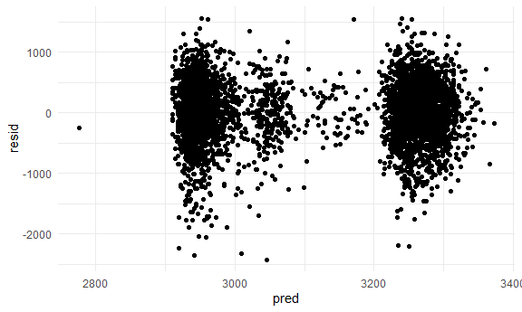

Homework 6
================
Laya Buchanan
2020-19-05

This is my submission for the sixth homework assignment for P8105.

## Problem 1

Read in the data.

``` r
birthweight_df = 
  read_csv("./data/birthweight.csv") %>% 
  mutate(babysex = recode(babysex, '1' = "male", '2' = "female"),
         malform = recode(malform, '0' = "absent", '1' = "present"),
         mrace = recode(mrace, '1' = "white", '2' = "black", '3' = "asian", '4' = "puerto rican", '8' = "other"),
         frace = recode(frace, '1' = "white", '2' = "black", '3' = "asian", '4' = "puerto rican", '8' = "other", '9' = "unknown")
         )
```

    ## Parsed with column specification:
    ## cols(
    ##   .default = col_double()
    ## )

    ## See spec(...) for full column specifications.

Next, I’m going to build a model to assess the relationship between
number of live births during pregnancy and baby’s birth weight. I am
also going to include the race of each parent, family income, and
mother’s age at delivery as potential confounders.

``` r
parity_fit = lm(bwt ~ parity + fincome + frace + momage + mrace, data = birthweight_df)
```

Next, I create a plot of model residuals against fitted values.

``` r
birthweight_df %>% 
  add_residuals(parity_fit) %>% 
  add_predictions(parity_fit) %>%
  ggplot(aes(x = pred, y = resid)) + geom_point()
```



Now, I will create two other models to compare my proposed model to, one
sing length at birth and gestational age as predictors (main effects
only), and the other using head circumference, length, sex, and all
interactions (including the three-way interaction) between these.

``` r
gaweeks_fit = lm(bwt ~ parity + gaweeks, data = birthweight_df)
interactions_fit = lm(bwt ~ babysex + bhead + blength + babysex*bhead + babysex*blength + blength*bhead + babysex*bhead*blength, data = birthweight_df)
```
