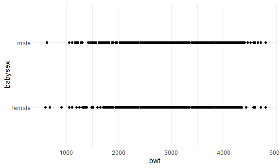
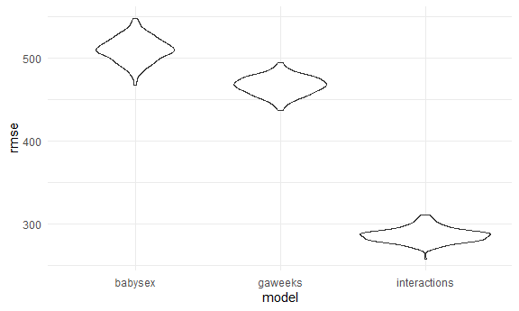
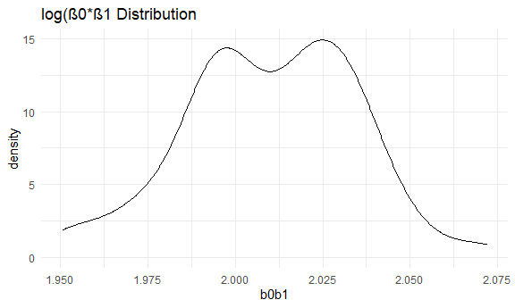

Homework 6
================
Laya Buchanan
2020-19-05

This is my submission for the sixth homework assignment for P8105.

## Problem 1

Read in the data.

``` r
birthweight_df = 
  read_csv("./data/birthweight.csv") %>% 
  mutate(babysex = recode(babysex, '1' = "male", '2' = "female"),
         malform = recode(malform, '0' = "absent", '1' = "present"),
         mrace = recode(mrace, '1' = "white", '2' = "black", '3' = "asian", '4' = "puerto rican", '8' = "other"),
         frace = recode(frace, '1' = "white", '2' = "black", '3' = "asian", '4' = "puerto rican", '8' = "other", '9' = "unknown")
         )
```

    ## Parsed with column specification:
    ## cols(
    ##   .default = col_double()
    ## )

    ## See spec(...) for full column specifications.

#### Model Building

I’m going to the variable babysex to see if it has an apparent crude
association with baby birth weight using a simple plot. I will also be
looking at the linearity of the association.

``` r
birthweight_df %>% 
  ggplot(aes(x = bwt, y = babysex)) + 
  geom_point()
```



In this case, we see an association with a binomial dependent variable,
so it will be appropriate to build a linear model to examine this
association. Next, I’m going to build a model to assess the relationship
between the sex of the baby and baby’s birth weight. I will not be
adding any other variables to this model because none of the other
variables are potential confounders.

``` r
babysex_fit = lm(bwt ~ babysex, data = birthweight_df)
```

Next, I create a plot of model residuals against fitted values.

``` r
birthweight_df %>% 
  add_residuals(babysex_fit) %>% 
  add_predictions(babysex_fit) %>%
  ggplot(aes(x = pred, y = resid)) + geom_point()
```


Now, I will create two other models to compare my proposed model to, one
sing length at birth and gestational age as predictors (main effects
only), and the other using head circumference, length, sex, and all
interactions (including the three-way interaction) between these.

First, I will assess the linearity of these relationships.

``` r
birthweight_df %>% 
  ggplot(aes(x = bwt, y = gaweeks)) + 
  geom_point()
```


``` r
birthweight_df %>% 
  ggplot(aes(x = bwt, y = gaweeks)) + 
  geom_point()
```


``` r
gaweeks_fit = gam(bwt ~ gaweeks, data = birthweight_df)

interactions_fit = gam(bwt ~ babysex + bhead + blength + babysex*bhead + babysex*blength + blength*bhead + babysex*bhead*blength, data = birthweight_df)
```

Next, I will make this comparison in terms of the cross-validated
prediction error.

``` r
cv_df = 
  crossv_mc(birthweight_df, 250) %>% 
  mutate(
    train = map(train, as_tibble),
    test = map(test, as_tibble)) 
```

``` r
cv_df = 
  cv_df %>% 
  mutate(
    babysex_fit = map(train, ~lm(bwt ~ babysex, data = birthweight_df)),
    gaweeks_fit = map(train, ~gam(bwt ~ parity + gaweeks, data = birthweight_df)),
    interactions_fit = map(train, ~gam(bwt ~ babysex + bhead + blength + babysex*bhead + babysex*blength + blength*bhead + babysex*bhead*blength, data = birthweight_df))) %>% 
  mutate(
    rmse_babysex = map2_dbl(babysex_fit, test, ~rmse(model = .x, data = .y)),
    rmse_gaweeks = map2_dbl(gaweeks_fit, test, ~rmse(model = .x, data = .y)),
    rmse_interactions = map2_dbl(interactions_fit, test, ~rmse(model = .x, data = .y)))
```

``` r
cv_df %>% 
  select(starts_with("rmse")) %>% 
  pivot_longer(
    everything(),
    names_to = "model", 
    values_to = "rmse",
    names_prefix = "rmse_") %>% 
  mutate(model = fct_inorder(model)) %>% 
  ggplot(aes(x = model, y = rmse)) + geom_violin()
```



Based on the distributions of the root mean squared errors, the model
featuring head circumference, length, sex, and all interactions between
these has the best fit, while the model I proposed has the worst fit.

## Problem 3

First, import the weather data.

``` r
weather_df = 
  rnoaa::meteo_pull_monitors(
    c("USW00094728"),
    var = c("PRCP", "TMIN", "TMAX"), 
    date_min = "2017-01-01",
    date_max = "2017-12-31") %>%
  mutate(
    name = recode(id, USW00094728 = "CentralPark_NY"),
    tmin = tmin / 10,
    tmax = tmax / 10) %>%
  select(name, id, everything())
```

    ## Registered S3 method overwritten by 'hoardr':
    ##   method           from
    ##   print.cache_info httr

    ## using cached file: C:\Users\layab\AppData\Local\Cache/R/noaa_ghcnd/USW00094728.dly

    ## date created (size, mb): 2020-10-01 08:04:33 (7.534)

    ## file min/max dates: 1869-01-01 / 2020-09-30

I am creating 5000 bootstrap samples from the data imported above, for
each bootstrap sample, I am producing estimates of r squared and
log(β0\*β1) and then plotting their distribution.

``` r
boot_straps = 
  weather_df %>% 
  bootstrap(100, id = "strap_number")

log_dist = 
  boot_straps %>% 
  mutate(
    models = map(.x = strap, ~lm(tmax ~ tmin, data = .x)), 
    results = map(models, broom::tidy)
  ) %>% 
  select(strap_number, results) %>% 
  unnest(results) %>% 
  select(strap_number, term, estimate) %>% 
  pivot_wider(
    names_from = term,
    values_from = estimate
  ) %>%
  janitor::clean_names() %>%  
  mutate(
    b0b1 = log(intercept*tmin)
  )

log_dist %>% 
ggplot(aes(x = b0b1)) + geom_density() +
  labs(
    title = "log(β0*β1 Distribution")
```



``` r
r_dist = 
  boot_straps %>% 
  mutate(
    models = map(strap, ~ lm(tmax ~ tmin, data = .x)),
    results = map(models, broom::glance)) %>% 
  select(results) %>% 
  unnest(results)

r_dist %>% 
  ggplot(aes(x = r.squared)) + geom_density() +
  labs(
    title = "r Squared Distribution")
```


They both follow a roughly normal distribution.

#### Confidence Intervals

Next, I will identify the 2.5% and 97.5% quantiles to provide a 95%
confidence interval for r^2 and log(β<sup>0∗β</sup>1).

``` r
log_dist %>% 
  summarize(
    ci_lower = quantile(b0b1, 0.025), 
    ci_upper = quantile(b0b1, 0.975)) %>% 
  knitr::kable(digits = 3)
```

| ci\_lower | ci\_upper |
| --------: | --------: |
|     1.956 |     2.051 |

``` r
r_dist %>% 
  summarize(
    ci_lower = quantile(r.squared, 0.025), 
    ci_upper = quantile(r.squared, 0.975)) %>% 
  knitr::kable(digits = 3)
```

| ci\_lower | ci\_upper |
| --------: | --------: |
|     0.893 |      0.93 |
